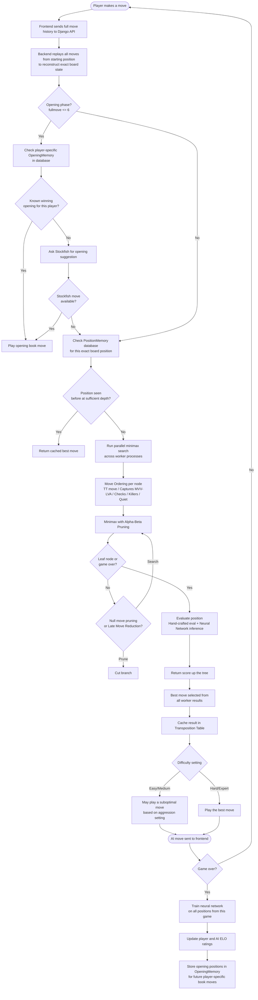

# Chess AI

A full-featured chess application with an adaptive AI opponent. Built with a React/Tauri frontend and a Django backend powered by minimax search, a trainable neural network, and Stockfish integration.

---

## Table of Contents

- [Features](#features)
- [Project Structure](#project-structure)
- [Prerequisites](#prerequisites)
- [Windows Build](#windows-build)
- [Linux Build](#linux-build)
- [Stockfish Setup](#stockfish-setup)
- [How the AI Works](#how-the-ai-works)

---

## Features

- Drag-and-drop chess board with full rule enforcement (castling, en passant, promotion)
- Adaptive AI that learns from each game and adjusts to player skill level
- ELO rating system for both player and AI
- Four difficulty levels (Easy, Medium, Hard, Expert)
- Opening tutorials, special move tutorials, and piece movement tutorials
- GPU acceleration on NVIDIA (CUDA), AMD (DirectML on Windows / ROCm on Linux), and CPU fallback
- Thermal monitoring that scales AI workers down when the CPU runs hot

---

## Project Structure

```
chess-ai/                          <- project root
|
|- rebuild.ps1                     <- Windows full build script
|- rebuild.sh                      <- Linux full build script
|- run_server.spec                 <- PyInstaller spec (root-level copy)
|- README.md
|
|- backend/                        <- Django REST API + AI engine
|   |- manage.py
|   |- run_server.py               <- Waitress server launcher (spawns workers, watchdog)
|   |- run_server.spec             <- PyInstaller spec used during build
|   |- requirements.txt
|   |- api/
|   |   |- views.py                <- REST endpoints (ai-move, train, player-stats, etc.)
|   |   |- minimax.py              <- Minimax search with alpha-beta, TT, killers, LMR
|   |   |- evaluation.py           <- Hand-crafted + neural net position evaluation
|   |   |- neural_net.py           <- PyTorch model definition and inference
|   |   |- learning.py             <- Training loop, replay buffer, position memory
|   |   |- stockfish_engine.py     <- Stockfish subprocess wrapper (opening book)
|   |   |- difficulty.py           <- Difficulty settings and aggression adaptation
|   |   |- hardware.py             <- GPU/CPU detection and worker count tuning
|   |   |- thermal_monitor.py      <- CPU frequency monitor, scales workers when hot
|   |   |- killer_moves.py         <- Killer move table (per-depth cutoff hints)
|   |   |- replay_buffer.py        <- Experience replay buffer for neural net training
|   |   |- models.py               <- Django ORM models (Player, PositionMemory, etc.)
|   |   |- urls.py
|   |   |- apps.py
|   |- chess_project/
|   |   |- settings.py
|   |   |- urls.py
|   |   |- wsgi.py
|
|- chess-ai/                       <- React/Vite frontend + Tauri wrapper
|   |- index.html
|   |- package.json
|   |- vite.config.js
|   |- src/
|   |   |- App.jsx                 <- Main app, game state, API calls
|   |   |- App.css
|   |   |- Tutorial.jsx            <- Opening and special move tutorials
|   |   |- PieceTutorial.jsx       <- Piece movement tutorials
|   |   |- Tutorial.css
|   |   |- openings.js             <- Opening move sequences
|   |   |- specialMoves.js         <- Castling/en passant/promotion tutorial data
|   |   |- pieceMovements.js       <- Piece tutorial slide data
|   |   |- components/
|   |   |   |- Board.jsx           <- Chessboard renderer and drag logic
|   |   |   |- HintPanel.jsx       <- Easy-mode move hint panel
|   |   |   |- GameOverModal.jsx
|   |   |   |- LoadingScreen.jsx
|   |   |   |- MiniBoard.jsx
|   |   |- hooks/
|   |   |   |- useBootSequence.js  <- Backend health-check and startup sequence
|   |   |- assets/pieces/          <- SVG chess piece images
|   |- src-tauri/                  <- Rust/Tauri native wrapper
|   |   |- src/main.rs             <- App entry point, backend process launcher
|   |   |- tauri.conf.json
|   |   |- Cargo.toml
|
|- stockfish/                      <- Stockfish chess engine
|   |- stockfish-windows-x86-64-avx2.exe   <- Windows binary (download separately)
|   |- stockfish-linux-x86-64-avx2         <- Linux binary (download separately)
|   |- src/                        <- Stockfish source (not required to run)
|
|- chessai/                        <- Python virtual environment (generated, not in git)
```

> **Note:** The `chessai/` venv, `node_modules/`, all `dist/`, `build/`, and `target/` folders are generated by the build scripts and are not tracked in git.

---

## Prerequisites

### Windows
- [Python 3.12+](https://www.python.org/downloads/)
- [Node.js 20+](https://nodejs.org/)
- [Rust toolchain](https://rustup.rs/) (includes `cargo`)
- Stockfish binary in `stockfish/` (see [Stockfish Setup](#stockfish-setup))

### Linux (Ubuntu/Debian)
- Python 3.12+, Node.js 20+, Rust toolchain (same as above)
- System libraries:
```bash
sudo apt install libwebkit2gtk-4.1-dev libgtk-3-dev libayatana-appindicator3-dev \
                 librsvg2-dev patchelf curl build-essential pkg-config
```
- Stockfish Linux binary in `stockfish/` (see [Stockfish Setup](#stockfish-setup))

---

## Windows Build

The build script handles everything: venv creation, dependency install, PyTorch GPU detection, frontend build, PyInstaller bundle, and Tauri MSI packaging.

```powershell
# Standard full build - produces ChessAI_x.x.x_x64_en-US.msi at the project root
.\rebuild.ps1

# Dev mode - launches the app without building an installer (faster iteration)
.\rebuild.ps1 -Dev

# Force a full Rust recompile (only needed if you change main.rs or Cargo.toml)
.\rebuild.ps1 -CleanRust
```

**What the script does, in order:**
1. Kills any running Chess AI or backend processes
2. Wipes app data (database, trained model, hardware cache)
3. Cleans frontend build and backend dist folders
4. Creates the `chessai/` Python virtual environment if it does not exist
5. Installs Python packages from `backend/requirements.txt`
6. Detects your GPU and installs the correct PyTorch build:
   - **NVIDIA GPU** → CUDA 12.4 wheel (`torch.cuda.is_available() = True`)
   - **AMD GPU** → CPU wheel + `torch-directml` (DirectX 12 GPU training on Windows)
   - **No GPU** → CPU wheel
7. Builds the React frontend with `npm run build`
8. Copies the built frontend into Django's `templates/` and `static/` folders
9. Runs PyInstaller to bundle the Django backend + Stockfish into `run_server.exe`
10. Strips unused CUDA DLLs to reduce bundle size by ~1.75 GB
11. Copies the bundle into `chess-ai/src-tauri/resources/`
12. Runs `npm run tauri build` to produce the final MSI installer

**Build time:** First build takes 30-90 minutes (Rust compiles from scratch). Subsequent builds are much faster because Rust caches compiled artifacts.

**Output:** `ChessAI_x.x.x_x64_en-US.msi` at the project root

---

## Linux Build

```bash
# Standard full build - produces .deb and .AppImage at the project root
./rebuild.sh

# Dev mode
./rebuild.sh --dev

# Force full Rust recompile
./rebuild.sh --clean-rust
```

**Key differences from the Windows build:**
- PyTorch GPU support: **NVIDIA** uses CUDA 12.4, **AMD** uses ROCm 6.2 (full GPU support on Linux, unlike Windows where AMD is DirectML only)
- Output formats: `.deb` (Debian/Ubuntu package) and `.AppImage` (portable, runs on any distro)
- Stockfish binary name: `stockfish-linux-x86-64-avx2` (no `.exe`)
- Virtual environment uses `chessai/bin/python` instead of `chessai/Scripts/python.exe`

**Output:** `ChessAI_x.x.x_amd64.deb` and `ChessAI_x.x.x_amd64.AppImage` at the project root

---

## Stockfish Setup

The Stockfish binary is not included in this repository because it exceeds GitHub's file size limit. You must download it separately and place it in the `stockfish/` folder before building.

**Windows:**
1. Download from [stockfishchess.org/download](https://stockfishchess.org/download/)
2. Choose the `Windows` build, `x86-64-avx2` variant
3. Rename the file to exactly: `stockfish-windows-x86-64-avx2.exe`
4. Place it in the `stockfish/` folder

**Linux:**
1. Download from [stockfishchess.org/download](https://stockfishchess.org/download/)
2. Choose the `Linux` build, `x86-64-avx2` variant
3. Rename the file to exactly: `stockfish-linux-x86-64-avx2`
4. Place it in the `stockfish/` folder
5. Make it executable: `chmod +x stockfish/stockfish-linux-x86-64-avx2`

> The build script will exit with an error if the binary is missing or misnamed.

---

## How the AI Works

### Overview

The AI is a custom minimax engine combined with a self-trained neural network and Stockfish for opening guidance. It adapts to each player over time using an ELO system and per-game learning.

### Move Decision Flowchart



### Key Components

| Component | File | What it does |
|---|---|---|
| Minimax Search | `minimax.py` | Alpha-beta pruning, null move pruning, late move reductions, iterative deepening |
| Transposition Table | `minimax.py` | LRU cache of previously evaluated positions keyed by Zobrist hash |
| Move Ordering | `minimax.py` | TT move > captures (MVV-LVA) > checks > killer moves > quiet moves |
| Killer Moves | `killer_moves.py` | Tracks moves that caused beta cutoffs at each search depth |
| Parallel Search | `minimax.py` | Lazy SMP via `ProcessPoolExecutor` — multiple workers search the same tree independently |
| Neural Network | `neural_net.py` | Small fully-connected PyTorch network trained on game outcomes |
| Position Evaluation | `evaluation.py` | Material count, piece-square tables, king safety, pawn structure + neural net weight |
| Learning | `learning.py` | Trains the neural net after each game; stores positions in SQLite |
| Stockfish | `stockfish_engine.py` | Subprocess wrapper used only for opening book guidance |
| Hardware Detection | `hardware.py` | Detects GPU type and VRAM; sets worker count and TT size accordingly |
| Thermal Monitor | `thermal_monitor.py` | Reads CPU frequency; reduces worker count if the CPU is throttling |
| Difficulty | `difficulty.py` | Time limits, max search depth, and aggression per difficulty level |
| ELO System | `models.py` | Standard ELO formula applied after each game for both player and AI |

### Learning and Adaptation

After every game the AI:
1. Trains the neural network on every position from that game, with the game outcome as the training signal
2. Updates the player's ELO rating and the AI's ELO rating
3. Stores opening positions (moves 1-6) in a player-specific opening book so it can repeat successful lines and avoid failed ones
4. Adjusts its **aggression** parameter — if the player played well the AI becomes more aggressive; if the player struggled it eases off

The AI never uses Stockfish as a training teacher. All learning comes purely from game outcomes.
